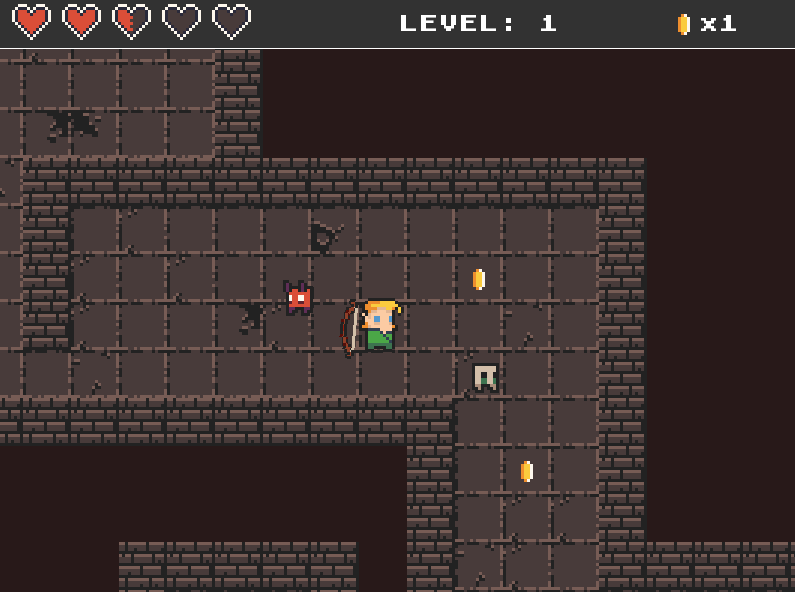
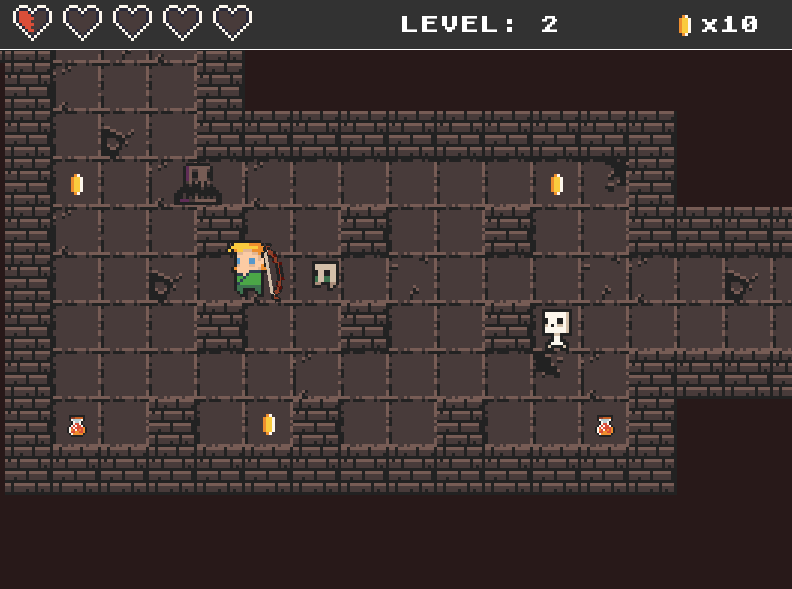

# 🏹 Dungeon Crawler - Pygame Adventure

Welcome to **Dungeon Crawler**, a fast-paced 2D survival game built with **Python** and **Pygame**!
You play as a brave archer battling waves of monsters - the longer you survive, the higher your score!

---

## 🎮 Game Description

You control a character armed with a **bow and arrows**, running through a monster-infested world.  
The goal is simple: **shoot, collect coins, and survive** as long as you can!

- 🧌 Battle against a variety of monsters  
- 🏃‍♂️ Move quickly and aim carefully  
- 💥 Score points for every coin you collect  
- 🧠 Implemented with **OOP principles** and modular design

---

## ✨ Features

- 🔁 **Game Loop** for real-time action and updates  
- 🎯 **Collision Detection** between arrows and enemies  
- 🧮 **Score System** with live score tracking  
- 🎮 **Keyboard Controls** for movement and shooting  
- 🎨 **Smooth animations** and real-time rendering using Pygame  
- 👨‍💻 Clean and extensible **Object-Oriented Design**

---

## 🛠 Technologies Used

- 🐍 **Python**
- 🕹 **Pygame**

---

## 🚀 How to Run the Game

1. 🔽 Clone the repository:
  ```bash
   git clone https://github.com/tomerbitonn/Python-Game.git
   cd Python-Game
```
2. 📦 Install dependencies:
```pip install pygame```
3. ▶️ Run the game:
```python main.py```

---

## 🖼 Screenshots



